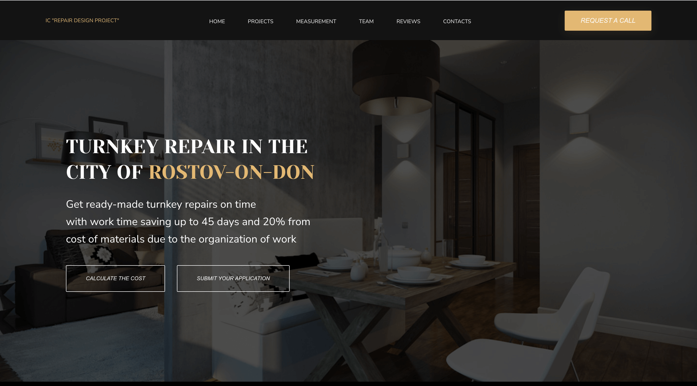

<h1 align="center">Contractor Portfolio Landing</h1>

 

  

## Demo

[Landing Project](https://evengene.github.io/landing-project/)

## Features:

    - Fully responsive for desktop and mobile devices
    - Smooth scrolling and navigation
    - HTML5 semantic elements
    - CSS3 transitions and animations
    - Portfolio slider build with JavaScript 
    - JavaScript DOM manipulation
    - JavaScript event listeners
    - Embeded Google Maps

## Build with:

    - HTML
    - CSS
    - JavaScript

## To do:

    - Potentially refactor the code to make it more DRY
    - Add more projects to the portfolio
    - Add a contact form with validation

## Author

👤 **Elina Shelest**

- Twitter: [@elygills](https://twitter.com/elygills)
- Github: [@evengene](https://github.com/evengene)
- LinkedIn: [@elina-shelest](https://linkedin.com/in/elina-shelest)

## Show your support

Give a ⭐️ if this project helped you!
